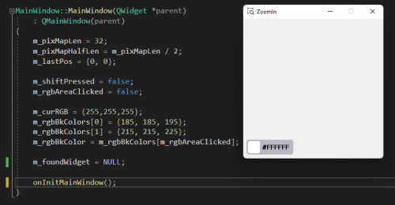

# zoomIn-qt

A Project using C++ to zoom window and select pixel color.

This project is useful for looking at the details of the little icons and choosing a color from them.

## How to build

```
mkdir build_debug && cd build_debug
cmake build ..
.\ZoomIn.sln
```

Clone this project and execute the above command line.

Then `ZoomIn.sln` file is gonna be executed with Visual Studio. You should build just, then can run this project.

But the Qt library is required to build and execute this project. You can download a free trial version of the Qt framework from the official Qt website.

## How to use

If you hold down the `Shift key` and `move the mouse`, the position where the mouse is located is drawn larger.

And when you `click on a pixel` in the application, this pixel color value will appear in the button below. To copy this color value you should just `click the button`.

You can select the zoom size ratio via `the mouse wheel`.

## Used tools

- C++
- Qt library
- CMake
- Visual Studio or Qt Creator

## Overview

  
  
  
  
